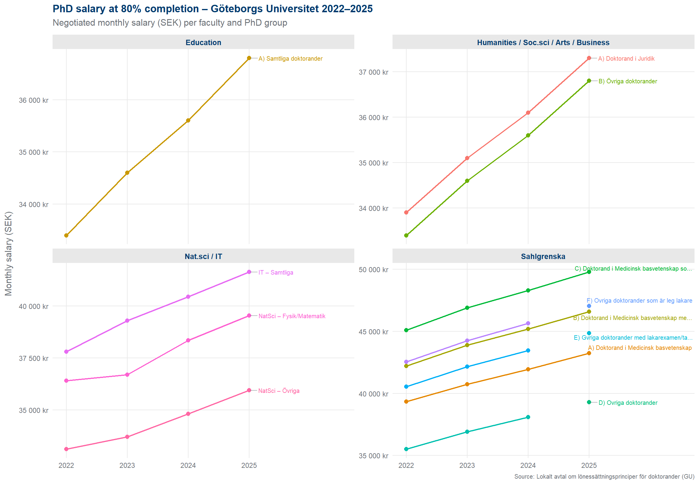
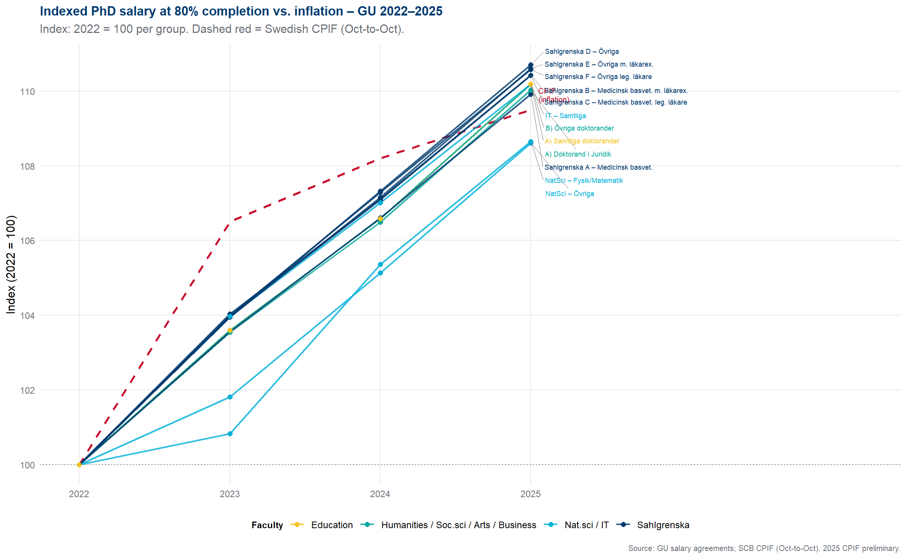
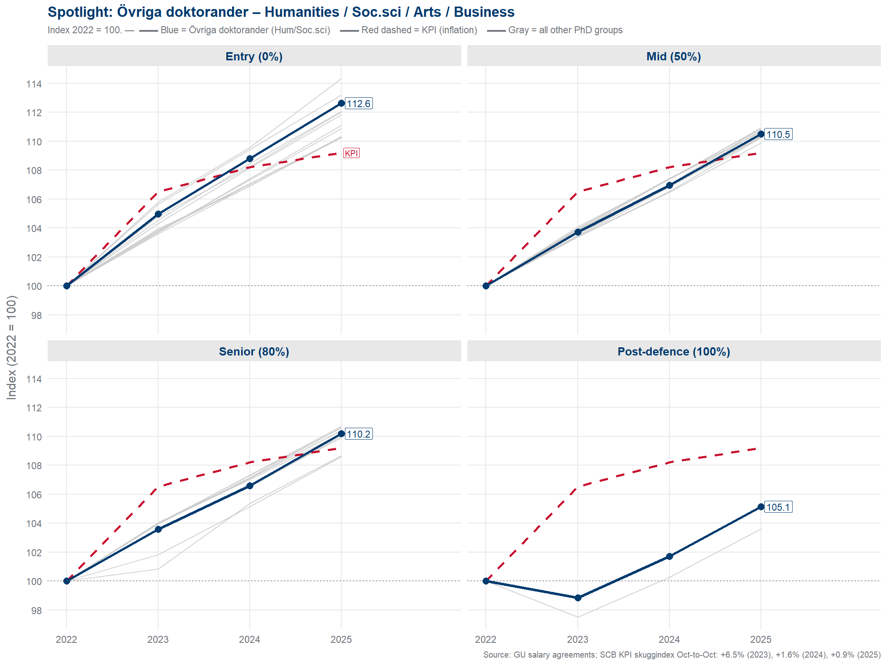

# PhD Salary Development at Göteborgs Universitet, 2022–2025

> **Note:** This report and all visualisations were fully generated by AI (GitHub Copilot / Claude Sonnet 4.5) based on the official negotiated salary agreements published by Göteborgs Universitet. No manual analysis has been performed. The purpose is purely to share structured information about how PhD salaries have developed over time.

---

## Background

Each autumn, PhD salaries at Göteborgs Universitet (GU) are renegotiated locally at the faculty level. The agreements set four salary steps tied to the share of completed PhD requirements:

| Step | Meaning |
|------|---------|
| **0 %** | Entry level — newly admitted |
| **50 %** | Mid-way through doctoral studies |
| **80 %** | Near completion |
| **100 %** | Post-defence / doctoral degree awarded |

This report covers the salary agreements for October 2022, 2023, 2024 and 2025, covering the following faculties and groups:

- **Sahlgrenska Akademin** — 6 groups (medical baseline, with/without medical degree, licensed physicians, etc.)
- **Naturvetenskapliga fakulteten / IT-fakulteten** — merged into one faculty from 2025; 2–3 groups
- **Konstnärliga / Humanistiska / Samhällsvetenskapliga fakulteterna / Handelshögskolan** — 2 groups (Juridik and Övriga)
- **Utbildningsvetenskapliga fakulteten** — 1 group

In total the dataset covers **48 observations** (12 groups × 4 years).

---

## Graph 1 — Salary at 80% completion across all groups, 2022–2025

This chart shows the **absolute monthly salary (SEK)** at the 80% completion step for every PhD group, broken out by faculty. Each line represents one PhD group; labels on the right identify the group at the 2025 data point.

The chart gives a quick sense of **how wide the salary spread is** between faculties and groups, and whether that spread is growing or narrowing over time. The y-axis is free-scaled per facet, so the slope — not the level — is what is comparable across panels.

---

## Graph 2 — Indexed salary vs. inflation (all groups, 80% level)

All salaries are here **re-expressed as an index where 2022 = 100**, making it possible to compare growth rates across groups regardless of the starting salary level. The dashed red line shows the cumulative Swedish **CPIF** (consumer price index, fixed interest rate) measured October-to-October — the same calendar as the salary negotiations.

CPIF reference values used:

| Period | Annual change | Cumulative from Oct 2022 |
|--------|--------------|--------------------------|
| Oct 2023 | +6.5 % | 106.5 |
| Oct 2024 | +1.6 % | 108.2 |
| Oct 2025 | +1.2 % *(prelim.)* | 109.5 |

Lines **above** the red dashed line indicate salary growth that outpaced inflation over the period; lines **below** indicate real-terms erosion.

---

## Graph 3 — Spotlight: Övriga doktorander, Humanities / Social Sciences

This chart focuses specifically on the **"Övriga doktorander"** group within the joint faculty of Konstnärliga / Humanistiska / Samhällsvetenskapliga fakulteterna / Handelshögskolan — the largest catch-all PhD group for humanities, social sciences, arts and business. The four panels correspond to the four salary steps (0 %, 50 %, 80 %, 100 %).

- The **blue line** is the highlighted group
- The **light grey lines** are all other PhD groups at GU, providing context
- The **red dashed line** is Swedish CPIF inflation

The index value printed at 2025 shows the cumulative salary growth from the 2022 base.

Salary values for this group:

| Year | 0 % | 50 % | 80 % | 100 % |
|------|-----|------|------|-------|
| 2022 | 28 675 kr | 30 950 kr | 33 400 kr | 35 000 kr |
| 2023 | 30 100 kr | 32 100 kr | 34 600 kr | 34 600 kr |
| 2024 | 31 200 kr | 33 100 kr | 35 600 kr | 35 600 kr |
| 2025 | 32 300 kr | 34 200 kr | 36 800 kr | 36 800 kr |

Cumulative change 2022–2025: **+12.6 %** (entry), **+10.5 %** (50 %), **+10.2 %** (80 %), **+5.1 %** (100 %). Cumulative CPIF over the same period was approximately **+9.5 %**.

---

## Data & Code

All source PDFs, the extracted dataset (`data/salaries.csv`) and the R visualisation script (`R/plot_salaries.R`) are available at:

**[github.com/simongren/salary-phd-gu](https://github.com/simongren/salary-phd-gu)**

Data was extracted from the official PDF attachments (*Bilaga 1*) to the locally negotiated salary agreements (*Lokalt avtal om lönessättningsprinciper för doktorander*, Dnr P 2016/121 and subsequent years). For the 2025 agreement the PDF was image-based and required OCR processing (Tesseract, Swedish language model).

---

*Generated by GitHub Copilot (Claude Sonnet 4.5) · February 2026*
